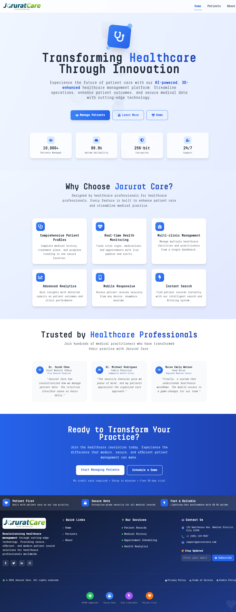
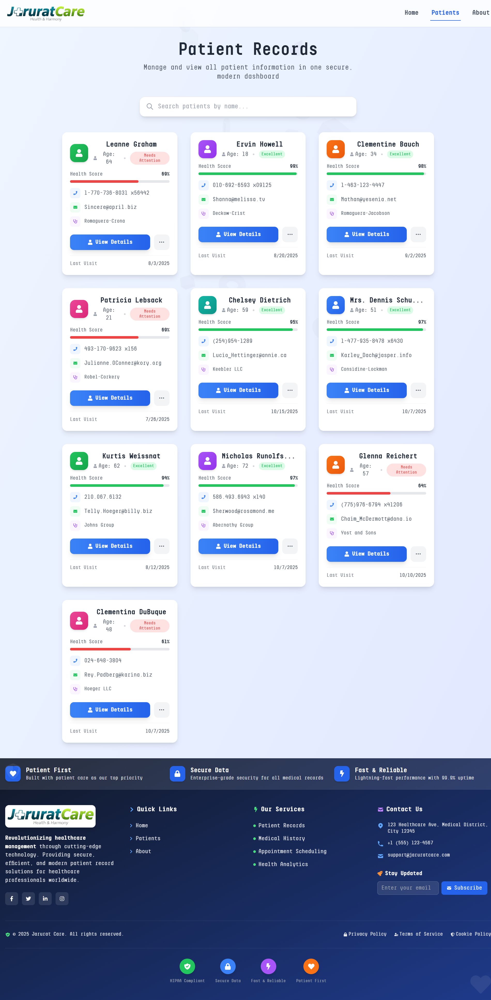
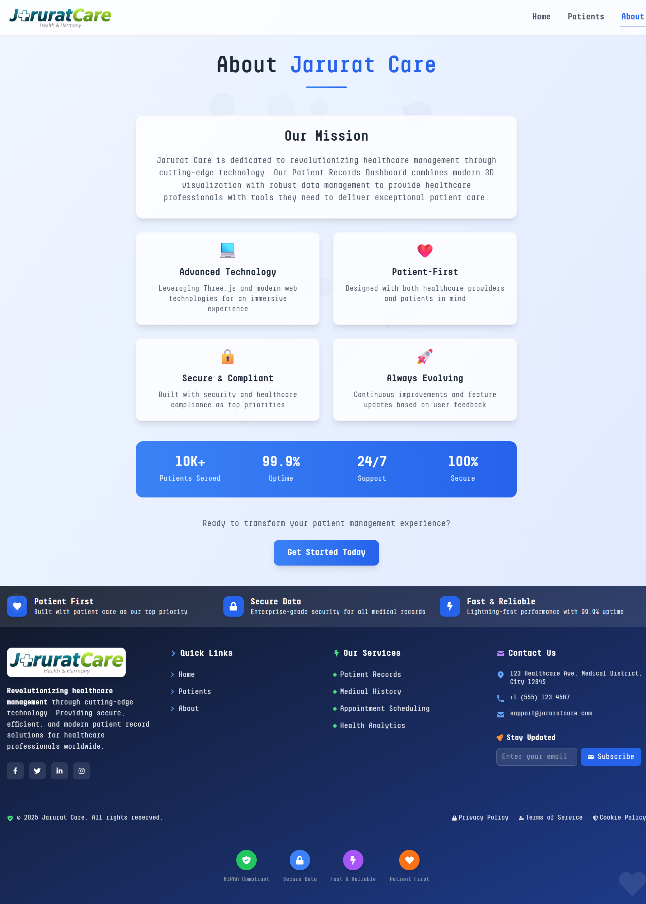
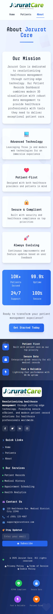

<<<<<<< HEAD
# 🏥 Jarurat Care – Patient Records Dashboard

A modern, responsive web application built with **React** that allows healthcare professionals to manage patient records easily.  
This project demonstrates practical skills in React, state management, API integration, and modern UI development.


## 🎯 Objective
To assess proficiency in React, state handling, and API communication by building a feature-rich **patient records dashboard** application.


## ✨ Features

### 🏠 1. Landing Page
- Simple header with the **Jarurat Care** logo and brand name.  
- Navigation bar includes links to **Home**, **Patients**, and **About** pages.  
- Clean and attractive hero section explaining the platform benefits.

### 👩‍⚕️ 2. Patients Page (Main Focus)
- Fetches patient data from an external public API (`JSONPlaceholder` users endpoint).  
- Displays patient information (Name, Age, Contact details, Health Score) in a responsive card/grid layout.  
- Implements a **search bar** to filter patients by name in real-time.  
- Each patient card has a **View Details** button that opens a modal with full patient info.  
- Dropdown menu on each patient card for quick actions — *Edit, Schedule Visit, Delete.*  
- **Loading spinners** and **error messages** improve UX during API calls.

### ⚙️ 3. State Management
- Uses **React Hooks** (`useState`, `useEffect`, `useContext`) for state handling.  
- Data fetching, search filtering, modal visibility, and patient selection managed cleanly.  
- Global loading spinner implemented via **React Context API**.

### 🎨 4. UI & Styling
- Fully **responsive design** adapting to desktop and mobile.  
- Styled using **Tailwind CSS** and custom fonts.  
- Includes **animated 3D backgrounds** using Three.js.  
- Accessibility features: keyboard support and ARIA labels.  
- Smooth modals and dropdowns with proper z-index & overlay control.

### 💡 5. Bonus (Optional Enhancements)
- Add new patients via a local form (not connected to backend).  
- Smooth global loader during API requests.  
- Deployed on **Vercel/Netlify** for easy access.

---

## 📸 Screenshots

### 🖥️ Desktop View
| Home Page | Patients Page | About Page |
|------------|----------------|-------------|
|  |  |  |

### 📱 Mobile View
| Home (Mobile) | Patients (Mobile) | About (Mobile) |
|----------------|-------------------|----------------|
|  |  |  |


## ⚙️ Installation & Setup

### 🧩 Pre-requisites
- Node.js (>= 14.x)
- npm or yarn package manager

### 🪜 Steps

```bash
# Clone the repository
git clone https://github.com/shauryajangid8925/Jarurat-Care-dashboard.git
cd jarurat-care-dashboard

# Install dependencies
npm install
# or
yarn install

# Start development server
npm start
# or
yarn start
=======
# Jarurat_Care
>>>>>>> 2d6df27007bb8ce2f5ef8525983b679a5d98a36d
